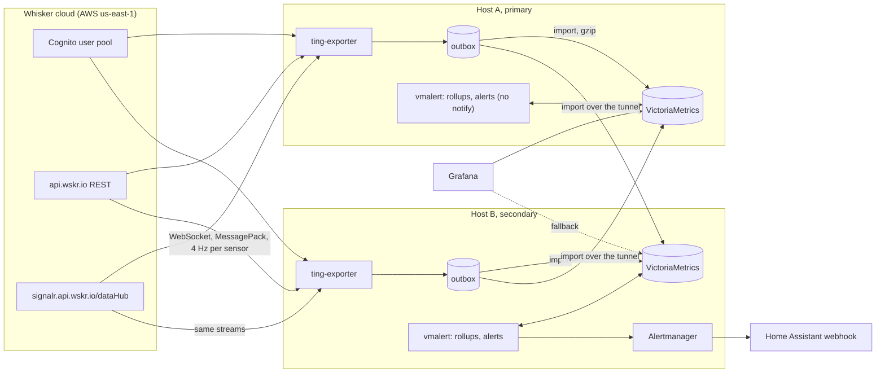

# Ting exporter: design (v3)

This document describes ting-exporter 3: what is known about the Ting cloud (Whisker Labs documents none of it;
everything here is reverse-engineered or taken from the MIT-licensed community integrations), the data model, the
components, how failures are handled, and how it is tested. It is meant to be enough to understand, change or
rewrite the exporter without reading the code first.

**Tags.**
- [Verified]: seen on the wire, in captured traffic, or tested against real VictoriaMetrics.
- [TBD]: unknown. Each one says how to find out.

Sensors are called **A** and **B** below; the examples use the serials `TNG000001`/`TNG000002` and the sites
`a`/`b`. Real serials, hosts and addresses belong in the private overlay (section 13), never in this repository.

---

## 0. Implementation notes

### 0.1 Details that matter
- **Restart fingerprint (5.4).** "Hi − Lo < 2.5 V" alone is not enough. A sensor that came back with a fresh,
  narrow window, went dark again a minute later and then returned shows the same window, slightly wider: narrow,
  but no second restart. A restart is therefore *narrow and shrunk*: Hi − Lo < 2.5 V and a lower high or a higher
  low than before the silence. [Verified, `tests/test_cuts.py`, fixture `f-cut`]
- **Attribution (5.4).** In active-active, a silence one exporter did not watch must not mark the shared stores.
  A silence is inferred only if this exporter was *watching*: no failed connect, socket error, refused
  subscription or sign-in wait since the last sample. A gap also needs *confirmation*: a subscription during the
  silence that stayed empty for 10 s (so the hub really had nothing; otherwise it may have been our own network).
  Across an exporter restart (the state file, written every 10 s and at shutdown) a cut is still inferred if the
  exporter was down at most 10 minutes; a gap never is. Session events feed the pipeline live and from the
  flight recorder, so replay infers the same.
- **No `-external.label=host` on vmalert (9.1, 10).** It labels the recording rules too, so the rollups the
  repair writes (6.8) would form separate series. The host label comes from the scrape config instead
  (`%{TING_HOST}`), so every alert on the exporter's and vmalert's metrics still names its host.
- **Webhook secret (6.9).** `secrets/alert/alert_webhook_url`, a directory of its own, mounted by Alertmanager and
  the exporters; the Ting password directory is mounted by the exporter only.
- **Data directories (13.1).** Every bind mount on the data disk and every secret directory has
  `create_host_path: false`: with the disk not mounted, Docker would otherwise create the data directories on the
  root disk.
- **Outbox file names (7.2).** Active: `seg-<seq>-<first ms>.prom`; sealed:
  `seg-<seq>-<first ms>-<last ms>-<count>.prom.gz`. The sequence number orders the log and never restarts (it is
  kept above every cursor's). `outbox/inbox/*.prom` takes lines from other processes (`mark`).
- **Configuration (7.6).** Variables of earlier versions (`TING_VM_URL`, `TING_SPOOL_DIR`,
  `TING_QUEUE_MAX_SAMPLES`) are refused with a message, not ignored.
- **Include block (13.3).** `path` lists `ting/deploy/compose.yml` and, on the notifying host,
  `ting/deploy/compose.notify.yml` (Alertmanager); the bundle is the repository tree plus the host's values.
- **Fresh reads (0.4).** VictoriaMetrics hides the newest 30 s from queries (`-search.latencyOffset`), so a context
  mark written moments ago would be missing from `mark --list` and from the next mark's lookup. Those queries ask
  with `latency_offset=1ms` (0 is refused). [Verified against v1.152.0]

### 0.2 Metrics, alerts and commands beyond the core
- `ting_inferred_silences_total{kind=cut|gap|unattributed}`, `ting_outbox_disk_ok`,
  `ting_outbox_rejected_files_total`, `ting_outbox_inbox_samples_total`, `ting_rollup_repair_runs_total`,
  `ting_rest_polls_total`, `ting_rest_missing`, `ting_health_check_up`, `ting_health_notifications_total`.
- Alert `TingHazard` (critical): Ting's hazard state ≥ 3 or a fire condition (0.5).
- Commands: `repair --from T [--to T]` (the rollup repair over any window, a day per pass, no cap: for imported
  history, which the periodic 48 h repair never reaches); `status` (the running exporter's `/readyz` in plain
  lines, exit 0 when ready); `compare-stores` without arguments compares the exporter's own two push targets.
- [docs/install.md](install.md): the first install for a new user, every block paste-safe (no comments or
  placeholders inside), host values read from the bundle's `site.env`; importing a previous install's history
  (flight recorder replay, vmctl from its data directory into every push target, then `repair`).
- T22 runs against the release images (`TING_VM_DOCKER`) or the release binaries, and rehearses the import of an
  old store with vmctl, the built image's `import` and `repair`.
- `tools/make_fixtures.py` writes the test fixtures: synthetic recordings of two simulated sensors, delivered the
  way the hub delivers (Appendix B).

### 0.3 External health checks
The exporter GETs every `TING_HEALTH_CHECKS` URL each minute (e.g. its VictoriaMetrics `/health`, vmalert
`/health`, Alertmanager `/-/healthy`, and the peer's VictoriaMetrics over the tunnel). One that fails for
`TING_HEALTH_FOR_SECONDS` (5 min) is posted straight to the Home Assistant webhook in Alertmanager's format
(`TingHealthCheckFailing`, labels `check`, `host`, `role`), resolved when it passes (with the failure's start
time), repeated every 12 h. This path needs neither VictoriaMetrics nor vmalert nor Alertmanager, so it covers "the
notifying host's alerting chain is down" and, through the peer check, "the notifying host is down". Two exporters
may report the same outage; that is the redundancy.

### 0.4 Context marks
`ting-exporter mark b source=inverter [--at T]` looks up the site's current value in the local store and writes
`ting_context{serial,site,context,value}` = 0 for the value that ends and 1 for the new one, at T. Run inside the
exporter's container it hands the lines to the running exporter's outbox (`inbox/`), which delivers them to every
store; `--vm-url` writes one store directly. A mark still in the inbox counts as current for the next mark and for
`mark --list`. `mark b source=` ends a context. Panels select with
`last_over_time(ting_context{context="source",value="inverter"}[5y]) == 1`; the dashboard has a "Power source"
row (the source in force, THD and Hi-Fi by source) and a context-mark marker.

### 0.5 REST values
Endpoints and fields from the community integration (Underzenith85 `ha-whisker-ting`, MIT), polled every 5 minutes:
`GET /api/v1/Users/{id}` (`fireHazardStatus`, `isFire`, `hasFrozenPipe`, `siteId`),
`GET /api/v1/Users/{id}/conditions` (`currentTemperatures` and `currentOutageRisks` per site, fresher device
fields), `GET /api/v1/FrozenPipe/{serial}` (`level`). A REST registry (`rest.py`) maps them to `ting_hazard_state`
(0 none, 1 learning, 2 reviewed not fire, 3 elevated suspicious, 4 power quality hazard, 5 fire hazard, -1
unknown), `ting_hazard_efh_level`, `ting_hazard_ufh_level`, `ting_fire_detected`, `ting_frozen_pipe_detected`,
`ting_frozen_pipe_level`, `ting_outdoor_temperature_celsius`, `ting_outage_risk`, pushed with the poll's minute as
the timestamp. Every field is optional; a 403 or 404 asks again hourly. Checked against a real account's replies
(`probe --rest`): no `isOnline` and no `hazardSeverityLevel` (not read), EFH/UFH `level` null while there is no
hazard, the outage risk a plain number per site that looks like a percentage. [Verified]

---

## 1. Scope

### Goals
1. Capture every measurement the Ting cloud delivers, at the full rate it delivers it (4 samples per second per
   sensor), and keep it for years.
2. Store each sample at the sensor's own timestamp, so data from retries, backlogs, replays and a second exporter
   lines up exactly.
3. Record the outages and alerts Ting reports to the phone app, and infer power cuts that Ting does not report.
4. Alert on data loss and on the exporter's own health, through Home Assistant.
5. Run active-active: two exporters at two sites, each writing both stores, so one site's internet, host or
   exporter outage leaves no hole.
6. Never endanger the Ting account (it is the phone app's account).

### Use cases
- Trend mains THD over months.
- Tell utility-side causes from in-house ones by correlating with breaker tests (notes on the dashboard).
- Compare power sources (mains, a battery inverter, a filter) by THD and Hi-Fi, with context marks (0.4).
- See brownouts, surges, cuts and their recovery transients at 0.25 s resolution.

### Non-goals
- No local API to the plug. There is none; everything comes from the Whisker cloud. [Verified]
- No Home Assistant integration for the data itself. HA caps stream updates at about 1 Hz. HA only receives
  alerts.
- No control of the Ting (no writes to the cloud other than subscribing).
- No 30 MHz arc-detection raw data. No known client exposes it. [TBD: watch the hub for new targets]
- No multi-tenant or multi-account support. One account per exporter.

---

## 2. What we know about the Ting cloud

Whisker Labs documents none of this. It comes from the official app's behaviour, the MIT-licensed community
integrations (simplytoast1, jasonjhofmann, Underzenith85 `ha-whisker-ting`, coffee-the-dev `ting-hass`) and
captured traffic. It can change without notice.

### 2.1 Sign-in (AWS Cognito) [Verified]
- Endpoint `https://cognito-idp.us-east-1.amazonaws.com/`, JSON POSTs with
  `Content-Type: application/x-amz-json-1.1` and `X-Amz-Target: AWSCognitoIdentityProviderService.<Operation>`.
- User pool `us-east-1_trW4gH661`, app client `4akjeqt9gtl8rgg1cksunipk9u` (public client, no secret).
- Flow `USER_SRP_AUTH`: `InitiateAuth` (USERNAME, SRP_A) → challenge `PASSWORD_VERIFIER` with `USER_ID_FOR_SRP`,
  `SALT`, `SRP_B`, `SECRET_BLOCK` → `RespondToAuthChallenge` with `PASSWORD_CLAIM_SECRET_BLOCK`,
  `PASSWORD_CLAIM_SIGNATURE`, `TIMESTAMP` → `AuthenticationResult` (AccessToken, RefreshToken).
- SRP-6a details that must be exact:
  - RFC 5054 3072-bit group, g = 2. `k = SHA256(00 || N_hex || 0 || g_hex)` over the padded hex.
  - Big integers are hashed as two's-complement bytes: odd-length hex gets a leading `0`; a first nibble ≥ 8
    gets a leading `00`.
  - `x = SHA256(salt || SHA256(pool_name || user_id_for_srp || ":" || password))`, where pool_name is the part
    after the underscore.
  - Session key: HKDF-SHA256 with salt `u`, info `"Caldera Derived Key\x01"`, first 16 bytes.
  - Signature: HMAC-SHA256(key, pool_name || user_id_for_srp || base64decode(secret_block) || timestamp).
  - Timestamp format `Sun Sep 7 03:04:05 UTC 2026` (English names, day not zero padded).
- `GetUser` with the AccessToken returns attributes `custom:user_id` and `custom:api_key`. These two are all the
  stream and the REST API need.
- `REFRESH_TOKEN_AUTH` turns a RefreshToken into a new AccessToken without the password. [TBD: whether this app
  client really issues refresh tokens. Check `ting_auth_signins_total{method="refresh"}` after a hub refusal.]
- An API key stayed valid through sessions of 15 to 18 hours. Its real lifetime is unknown. [Verified / TBD]
- Lockout policy unknown. Treat every rejected password as dangerous. [TBD]

### 2.2 REST API [Verified unless marked]
- Base `https://api.wskr.io`. Headers `Authorization: Bearer <AccessToken>`, `x-wl-api-key: <api_key>`,
  `Accept: application/json`.
- `GET /api/v1/Users/{user_id}`: the account, with `devices[]`: `serialNumber`, `name`, `type` (`FireSensor`),
  `version` (firmware, e.g. `SparkFault 2.6.17`). All sensors of an account can carry the home's name, so `name` is
  useless as a label.
- `GET /api/v1/Notifications/history/{user_id}`: what the phone app alerts on, about three months deep. Records:
  `id`, `eventType`, `eventCategory`, `title`, `subtitle`, `message`, `eventTimestampUtc`, `eventTimestampLocal`,
  `sentUtc`, `serialNumber`, `siteId`, `isAcknowledged`, `isCleared`. Sometimes wrapped in an object; take the first
  list value.
  - `eventTimestampUtc` is the placeholder `0001-01-01T00:00:00`. `eventTimestampLocal` carries its UTC offset
    and is the real event time.
  - Types seen: `PowerOutage`, `CommunityPowerOutage`, `PowerRestored`, `PowerOrInternetRestored`,
    `PowerOutageAndRestored`, `Sag`, `Swell`. Named by community code, not seen: `FireHazard`, `WeatherAlert`,
    `FrozenPipe`.
  - A community notice can come about a minute after the site notice.
- `GET /api/v3/Devices/{serial}/voltage/dateRange?startUtc=..&endUtc=..`: the cloud's own voltage history.
  Community code says at most 24 h per request, about 31 days back. **It answered 403 for the accounts tried.**
  Not usable. [Verified]
- 401 means the token is stale: renew once. 403 means not allowed: do not renew, retry hourly. [Verified]
- Hazards, outdoor temperature, outage risk and frozen pipe: 0.5. Other data the community integrations show
  (grounding loss, generator start/stop events) is not read. [TBD: `probe --notifications` dumps every device
  field and notification type an account sees.]

### 2.3 The data hub (SignalR) [Verified]
- `wss://signalr.api.wskr.io/dataHub`, headers `Origin: ionic://localhost` and `x-wl-api-key: <api_key>`.
- Handshake: send `{"protocol":"messagepack","version":1}` + `0x1E`, expect `{}` + `0x1E`. Hub bytes can follow
  the handshake in the same frame.
- Framing: `<VarInt length><MessagePack array>`, several per WebSocket frame. Messages: Invocation
  `[1, headers, id, target, args, streamIds]`, Completion `[3, headers, id, kind, result?]`, Ping `[6]`,
  Close `[7, error?, allowReconnect?]`.
- Subscribe: `InitializeStreaming` with args
  `[{"StationId": serial, "DataElement": element}, api_key, user_id]`. Elements: `ComboBinaryData` (required),
  `frequency`, `thdMin`, `thdAvg`, `thdMax`. The ack is a Completion with kind 3 and a null result. Kind 1 is an
  error. An error with empty text is still a refusal.
- `UnInitializeStreaming` with the same args releases a subscription.
- The client sends a Ping every 5 s. The hub did not recycle sessions; single sessions lasted 18 h.
- **Several clients can stream the same sensor at once.** Two parallel subscriptions both got every sample.
  **But `UnInitializeStreaming` from any one client ends the stream for all clients of that sensor.** So no
  client may release unless it is the only one.
- A sensor whose site has no power: the hub accepts the subscription and sends nothing. [Verified]

### 2.4 Stream content [Verified, 24 h of captured traffic]
| Target | Payload | Rate |
|---|---|---|
| `updateComboBinaryData` | `args[0]` is a MessagePack **map**, every time: `Voltage` (RMS volts), `VoltageHi`, `VoltageLo`, `AveragePeaksMax` (Hi-Fi), `DataTimeUtc` (MessagePack timestamp) | 4.00 Hz in device time |
| `updateGraphMultiCategorical` | `args[0]` is a list of `{Category, Value, ObsTime}`. `Value` is a **string**. `frequency` comes alone, with every combo sample, `ObsTime == DataTimeUtc`. THD comes as one message with three records (`thdMin`, `thdAvg`, `thdMax`). | frequency 4 Hz; THD changes about every 30 s |
| `updateGraphMulti` | an exact duplicate of the categorical data. .NET time strings with 7 fractional digits. | as categorical |

- The combo payload has named keys, not values in a fixed order. The decoder reads keys, not positions.
- On the live delivery path the hub repeats the last THD value at 4 Hz; very few of those samples are changes.
- Timestamps arrive as MessagePack timestamp extensions. Record files hold ISO strings. Accept both, and .NET
  strings with 7 fractional digits.

### 2.5 Delivery timing [Verified]
- Two delivery paths: **live**, about 0.55 s after the device time (a 0.52-0.58 s floor), and **buffered**, 4-8 s
  late, paced at exactly 4 Hz. The hub switches between them hundreds of times a day. The device timeline stays
  continuous across every switch. Worst delay seen: 13 s.
- So arrival time is wrong by seconds, puts 7-13 % of samples in the wrong minute, and reorders about 0.7 %.
  Device time is the sample time.
- In arrival order about 2 % of samples are out of order by device time. Reorder nothing: VictoriaMetrics accepts
  out-of-order samples.
- After subscribing, the hub sends about 6 s of catch-up and no older backlog. A reconnect gap is real loss.
- Completeness by device time: 99.7 %. Natural silences up to 30 s happen and recover by themselves. They are
  sensor-side; a silence on two sensors at different sites at once has a shared cause upstream (5.4).
- A sensor sometimes carries a second, phase-shifted 4 Hz series for a few seconds ("overlap episodes", about
  0.2 % of samples, unexplained). Minutes with more than 240 samples are normal.

### 2.6 The sensor's values [Verified]
| Signal | Normal range | Notes |
|---|---|---|
| Voltage | about 114-126 V | A brownout can sit around 50 V for minutes with THD above 15 %, then overshoot (above 128 V, 60.5 Hz) at recovery |
| Frequency | 59.94-60.05 Hz | Quantum about 0.000141 Hz. Sites on different grids do not correlate at all. |
| THD | ratio 0.03-0.10 | 0.03 = 3 %. Each sensor has its own level. |
| Hi-Fi (`AveragePeaksMax`) | integers, from single digits to around 100; an inverter can go higher | No documented unit. Compare a sensor with its own baseline. |
| `VoltageHi` / `VoltageLo` | change a few times a day, near hh:00:08 | The sensor's own **long-window** extremes (at least 15 h, likely 24 h). **Not** per-sample min and max. |

- A Ting is powered from the outlet it measures. It cannot record its own outage. It goes dark, and when power
  returns it restarts. The restart resets its Hi/Lo window onto the current voltage: Hi and Lo then sit within
  2.5 V of each other (normally 4-10 V apart). That collapse is the fingerprint of a power cut at the site.
- Ting does not report every disturbance: brownouts the sensor rode through, and some cuts, are missing from the
  notification history.

---

## 3. Assumptions that do not hold

| Assumption | What is true | Consequence |
|---|---|---|
| Each voltage push is four float64 values in an undocumented order | A MessagePack map with named keys, every time | Decode by key. Nothing to map. [Verified] |
| `VoltageHi`/`VoltageLo` are the high and low of each sample period | They are the sensor's long-window extremes | Store them as `ting_voltage_rolling_*`, on change. Per-minute extremes come from the 4 Hz voltage. [Verified] |
| The cloud's voltage history can backfill gaps | 24 h per call, about 31 days back, and 403 for the accounts tried | No backfill from the cloud. Backfill only from our own flight recorder. [Verified] |
| The Hi-Fi index is not in the API | It is `AveragePeaksMax` in every combo sample, 4 Hz | Stored as `ting_hifi`. [Verified] |
| A 1 s Prometheus scrape is enough | A 1 s scrape keeps 1 of 4 samples and stamps scrape time | Push every sample with its device timestamp (6.1). |
| min, max, avg at query time over raw data | Query-time aggregation over a month of raw 4 Hz data is slow on small hardware and hits `-search.maxSamplesPerSeries` (30 M, about 86 days of one series) | Keep raw data and add 1-minute rollups for long ranges (5.5). |

---

## 4. Architecture



### 4.1 Principles (the invariants every component keeps)
1. **Idempotent writes.** Every sample carries a deterministic timestamp (device time). A retried batch, a
   drained backlog, a replayed file or the second exporter's copy is identical, and VictoriaMetrics keeps one
   (`-dedup.minScrapeInterval=1ms`). [Verified]
2. **The receive path never blocks and never fails because of anything downstream.** Decoding, storage,
   recording and pushing errors are counted, never raised into the WebSocket loop.
3. **Bounded everything.** Every queue, set, cache and file area has a cap. Every cap overflow is counted and
   alerted.
4. **A cloud outage never restarts anything.** Restarts cost sign-ins. Only a wedged process restarts.
5. **Never release a hub subscription** unless explicitly configured. [Verified]
6. **Secrets never leave the process.** Not in logs, metrics, labels, record files, reprs, environment or
   exception texts.
7. **Live equals replay.** The same pure pipeline turns live frames and recorded frames into samples.
8. **Shutdown fits Docker's grace period** (20 s) and loses at most what is unrecoverable. [Verified]
9. **Every lost sample is counted** and raises an alert. Silence is never success.

### 4.2 Process model
One asyncio process. Python 3.13, two runtime dependencies: `aiohttp` and `msgpack`. No `prometheus_client`: the
exposition format is simple enough to write in about 150 lines, which removes a dependency and gives full control
of label escaping.

Tasks, each under a supervisor (a crash is logged, counted, restarted with 1 s → 60 s backoff, reset after 5 min
of stability):

| Task | Count | Job |
|---|---|---|
| hub session | one per sensor | connect, subscribe, receive, watchdog, reconnect |
| pusher | one per push target | read the outbox from its cursor, POST, advance |
| outbox writer | 1 | append batches every 5 s, rotate, compress, garbage-collect |
| notifications | 1 | poll the history every 60 s, derive outages |
| REST values | 1 | poll hazards and conditions every 5 min (0.5) |
| discovery | 1 | device list hourly (names, firmware, new sensors) |
| password watch | 1 | fingerprint the password file every 60 s |
| recorder | 1 | flush every 10 s, rotate hourly, retention sweep hourly |
| rollup repair | 1 | fill missing rollup minutes (6.8) |
| health checks | 1 | external checks with their own notification path (0.3) |
| heartbeat and watchdog | 1 + 1 thread | liveness, self-exit when wedged |
| HTTP server | 1 | `/metrics`, `/healthz`, `/readyz` |

Why Python and not Go: the protocol layer (SRP, SignalR framing, decoder, outage logic) is covered by tests
against protocol-faithful fakes. The load is tiny (about 24 samples a second for two sensors). Go would save about
40 MB of RSS and nothing that matters. The design does not depend on the language.

---

## 5. Data model

### 5.1 Labels
- Every series carries `serial` and `site`.
- `site` comes from config `TING_SITES=serial=site,...`. Allowed: `[A-Za-z0-9_.-]{1,32}`. Serials:
  `[A-Za-z0-9]{4,32}`. A sensor without an entry gets `site="unknown"` and a warning.
- **One sensor per site.** Restart detection and inferred cuts compare a site's own high and low; two sensors at
  one site would mix them. A second sensor at the same place gets its own site name.
- Message texts (titles, places) never become labels, except the notification `title`, which is the generic
  event title. Raw records stay in the flight recorder.
- Device metadata (name, type, firmware) lives only in the scraped `ting_device_info`.

### 5.2 Signal registry
All stream signals are defined in **one table**. Decoder, subscription list, storage rule, rounding, metric
metadata, rollup rules and the independent reference script all derive from it. Adding a signal is one entry.

| Key | Source | Field | Metric | Unit | Round | Check | Stored | Rollups (1 min) |
|---|---|---|---|---|---|---|---|---|
| voltage | combo | `Voltage` | `ting_voltage_volts` | V | 0.001 | 0 < v ≤ 300, required, primary | every sample | min, max, avg (0.0001), count |
| hifi | combo | `AveragePeaksMax` | `ting_hifi` | 1 | integer | v ≥ 0 | every sample | min, max, avg (0.01) |
| rolling_high | combo | `VoltageHi` | `ting_voltage_rolling_high_volts` | V | 0.001 | 0 < v ≤ 300 | on change, 60 s heartbeat | none |
| rolling_low | combo | `VoltageLo` | `ting_voltage_rolling_low_volts` | V | 0.001 | 0 < v ≤ 300 | on change, 60 s heartbeat | none |
| frequency | categorical | `frequency` | `ting_frequency_hertz` | Hz | 0.0001 | 0 < v < 1000 | every sample | min, max, avg (0.00001) |
| thd | categorical | `thdAvg` | `ting_thd_ratio` | ratio | 0.00001 | v ≥ 0 | on change, 60 s heartbeat | avg (0.00001) |
| thd_min | categorical | `thdMin` | `ting_thd_min_ratio` | ratio | 0.00001 | v ≥ 0 | on change, 60 s heartbeat | min |
| thd_max | categorical | `thdMax` | `ting_thd_max_ratio` | ratio | 0.00001 | v ≥ 0 | on change, 60 s heartbeat | max |

- Rounding before the push cuts VictoriaMetrics storage about 4× and loses nothing measurable (frequency quantum
  0.00014 Hz, voltage noise far above 1 mV). [Verified by emulation]
- "On change, 60 s heartbeat": store when the rounded value differs from the last stored one, or 60 s of device
  time have passed. A late sample (older than the last stored) must not move the "last stored" time backwards.
- Rates per sensor: 4 Hz × 3 every-sample signals = 12 samples/s, plus about 6 THD and Hi/Lo samples a minute.

### 5.3 Notification series [Verified rules]
| Metric | Value | Meaning |
|---|---|---|
| `ting_notification{serial,site,type,category,title}` | 1 | one sample per notification, at its event time |
| `ting_power_outage{serial,site}` | 1 = at the site, 2 = community-wide; 0 at the end | every whole minute from start to end |

Outage rules (all deterministic for a given history and "now"):
1. Event time: the first of `eventTimestampUtc`, `eventTimestampLocal`, `sentUtc` that parses to a time between
   2020-01-01 and now + 2 days.
2. Brownouts and cuts are separate events. A `Sag` may come before a cut, after it, or alone. It never starts or
   extends an outage.
3. An outage ends at the earliest of: its restore (any `…Restored` type, however late: a 40 h storm outage is
   40 h); a notification only a powered sensor sends (`Sag`, `Swell`: the power is back, if low; the end is an
   upper bound); the next cut (`PowerOutage`, `PowerOutageAndRestored`: its restore was missed).
4. `PowerOutageAndRestored` is also a one-minute outage of its own, after closing any open one.
5. An outage with no news at all is drawn for 24 h and no further, without a closing 0. A restore that comes later
   still closes it at its own time.
6. An open outage is written only up to 3 min before now, so the restore (it arrives within about a poll) lands
   after the last written minute.
7. `CommunityPowerOutage` upgrades the open outage, or one that ended at most 5 min before it (Ting classifies
   short cuts late), instead of opening a new one. The upgrade rewrites the same timestamps with 2;
   VictoriaMetrics keeps the larger value on equal timestamps. [Verified]
8. The whole history goes in at the first poll, so outages from before the exporter ran are there too.
9. The tracker remembers pushed samples, forgets records that left the server's history once nothing can pair
   with them, and never forgets on an empty answer (that may be a hiccup).

### 5.4 Inferred power cuts
Inferring unreported cuts in the dashboard needs a look-ahead subquery: slow, a raised
`-search.maxPointsSubqueryPerTimeseries`, and a cut longer than the look-ahead marked only for its end. So the
exporter infers them, where the facts are at hand:

- When a sensor's stream has been silent for ≥ 60 s while its hub session is connected (or reconnecting), the
  session remembers the last device timestamp before the silence.
- When samples return, the first combo payloads show whether Hi and Lo collapsed (`VoltageHi − VoltageLo <
  2.5 V`, and the window shrank across the silence: 0.1). Collapsed: a power cut. Not collapsed: network or cloud.
  Only a silence this exporter watched is inferred (0.1).
- A cut writes `ting_power_cut{serial,site}` = 1 at the silence start and every whole minute until the return,
  then 0 at the first returned sample. Gap without a restart: `ting_stream_gap{serial,site}` the same way.
- Both exporters infer from the same device timestamps, so their samples mostly coincide; where they differ the
  union is still correct (all 1s).
- The last-sample state is written to a small state file on shutdown, so a restart during a cut still infers it.
- False positives: anything else that restarts the sensor (a firmware update) looks like a power return. Two
  sensors at different sites "restarting" within seconds of each other point to a shared cause (the cloud, or the
  exporter's own stream), not to power at both sites. [TBD: not told apart yet (15)]

### 5.5 Rollups (vmalert) [Verified]
- One group, `interval: 1m`, `eval_delay: 60s`. Rule names `ting:<metric without ting_>:<agg>_1m`, e.g.
  `ting:voltage_volts:min_1m`. Generated from the registry by `ting-exporter rules`; a test fails if the file
  differs.
- The value stamped at minute T covers `(T−60 s, T]`. A minute without raw data has no rollup point. vmalert
  rejects unknown fields; `eval_delay` is a supported group field. [Verified]
- `count_1m`: 240 is a full minute, above 240 happens (overlap episodes), below 228 is degraded.
- Averages are rounded in MetricsQL (`round(x, step)`). On an exact tie the last digit can differ from Python.
- Free VictoriaMetrics has no downsampling, hence vmalert.

### 5.6 Self-metrics (scraped every 30 s, `job="ting-exporter"`)
Per-sensor ones carry `serial` and `site`. Per-target ones carry `target`.

| Metric | Type | Meaning |
|---|---|---|
| `ting_exporter_build_info{version,role,host}` | gauge | 1 |
| `ting_device_info{name,type,firmware}` | gauge | 1, hourly |
| `ting_stream_connected`, `ting_stream_up` | gauge | socket open and subscribed; voltage within the stale limit |
| `ting_stream_connects_total{result=ok\|refused\|error}` | counter | connection attempts |
| `ting_stream_disconnects_total{reason=stale\|server_close\|ws_error\|shutdown\|error}` | counter | session ends (failed connects are not disconnects) |
| `ting_stream_errors_total{kind}` | counter | bugs, undecodable frames |
| `ting_last_sample_timestamp_seconds`, `ting_last_receive_timestamp_seconds` | gauge | newest device time; host time it arrived |
| `ting_clock_offset_seconds`, `ting_delivery_delay_seconds` | gauge, histogram | arrival − device of the newest sample (only from samples newer than the newest seen); buckets 0.25 … 300 s |
| `ting_samples_received_total{metric}`, `ting_samples_emitted_total{metric}` | counter | after decode; after storage rule and dedup |
| `ting_samples_discarded_total{reason}` | counter | `no_payload`, `bad_<key>`, `implausible_<key>`, `no_timestamp`, `unknown_category`, `bad_record` |
| `ting_samples_duplicate_total`, `ting_samples_late_total`, `ting_device_gap_slots_total` | counter | dedup drops; out of order (normal); upper bound on missing 0.25 s slots |
| `ting_timestamp_fallback_total` | counter | device time rejected by the guard |
| `ting_hub_messages_total{target}` | counter | every invocation, including `updateGraphMulti` |
| `ting_push_samples_total{target,result=ok\|rejected\|dropped}` | counter | outcomes |
| `ting_push_requests_total{target,code}`, `ting_push_duration_seconds{target}` | counter, histogram | POSTs |
| `ting_push_up{target}` | gauge | 1 while the target takes data (set on the first successful POST of a recovery) |
| `ting_push_lag_samples{target}`, `ting_push_lag_seconds{target}` | gauge | outbox samples behind this target's cursor; age of its oldest unsent sample |
| `ting_outbox_bytes`, `ting_outbox_segments`, `ting_outbox_errors_total` | gauge, counter | outbox size and write errors |
| `ting_auth_state` | gauge | 0 ok, 1 backing off, 2 held |
| `ting_auth_signins_total{method=srp\|refresh,result=ok\|rejected\|error}` | counter | sign-ins |
| `ting_task_restarts_total{task}` | counter | supervisor restarts |
| `ting_record_enabled`, `ting_record_lines_total`, `ting_record_errors_total`, `ting_record_bytes` | mixed | flight recorder |
| `ting_notifications_in_history{type}` | gauge | records in the last poll |
| `ting_notifications_unparsable` | gauge | records of the last poll without id, serial or plausible time |
| `ting_power_outage_active{kind}` | gauge | 1 while a reported outage has not ended (0 after 24 h without news) |
| `ting_notification_polls_total{result}`, `ting_notification_last_poll_timestamp_seconds` | counter, gauge | the poll |
| `ting_rollup_repaired_minutes_total{target}`, `ting_rollup_stale_minutes{target}` | counter, gauge | 6.8 |

More in 0.2.

---

## 6. Design decisions

### 6.1 Pull or push: push
A Prometheus scrape every second keeps one of four samples and stamps them with scrape time. Per-scrape
aggregates (last, min, max, count) lose the waveform and still stamp arrival time, so retries and two exporters
cannot line up. Pushing every sample to `POST /api/v1/import/prometheus` with its device timestamp keeps all
data, makes writes idempotent and lets two exporters fill each other's gaps.
- Format: Prometheus text with a millisecond timestamp, e.g.
  `ting_voltage_volts{serial="TNG000001",site="a"} 124.996 1790603992097`. Readable, `curl`-able, and the same bytes
  serve as the outbox format. gzip level 5. [Verified]
- VictoriaMetrics answers 204 even when it drops lines (unparsable, older than the retention, more than 2 days
  ahead). Those show only in `vm_rows_invalid_total` and `vm_rows_ignored_total`, which are alerted. [Verified]
- Self-metrics stay pulled (VictoriaMetrics scrapes `/metrics` every 30 s).

### 6.2 Timestamps: device time, guarded [Verified]
- `delay = arrival − device`. If `−2 s ≤ delay ≤ 300 s`: use the device time (ms). Otherwise stamp
  `arrival − 0.55 s` and count a fallback.
- `TING_TIMESTAMP_SOURCE=arrival` exists for diagnosis. In that mode, and for every fallback, stamps of one
  series must strictly increase (two frames can arrive in the same millisecond and are two readings).
- Device times are rounded half-up to the millisecond in integer arithmetic.
- The host's NTP sync matters only for the guard, the delay metric and vmalert's schedule. A stale clock after a
  power cut could re-stamp good samples. Log once per minute per sensor when the guard fires.

### 6.3 Field mapping and how to verify it [Verified]
The combo payload is a named map, so there is no ordering to verify. To check values against the Ting app:
`probe --seconds 60` prints, per sensor per second, the decoded voltage, Hi-Fi, frequency and THD with the
delivery delay and path (live or buffered). Compare with the app's live view. THD in the app is a percentage
(ratio × 100). Do not leave the app's live view open while testing releases (2.3).

### 6.4 Auth lifecycle [Verified]
IdentityManager owns sign-in for the whole process:
- One sign-in at a time. Concurrent callers share the result.
- States: `ok`, `backoff`, `hold`.
- **Hold** (rejected credentials: `NotAuthorizedException`, `UserNotFoundException`, `PasswordResetRequired`,
  `UserNotConfirmed`, an unexpected challenge such as MFA, any unknown 4xx; also an unreadable or non-UTF-8
  password file): no automatic attempt for 6 h. A changed password file (checked every 60 s by mtime and
  SHA-256) lifts the hold at once. The fingerprint stored is that of the bytes actually sent, so a fix written
  during an in-flight sign-in is noticed.
- **Backoff** (throttling, 5xx, network, any reply of an unexpected shape): 30 s doubling to 15 min, jittered.
  Nothing but "unavailable, retry in N s" ever leaves `get()`.
- At most 6 successful sign-ins per hour.
- A hub refusal or a REST 401 renews with `REFRESH_TOKEN_AUTH` first, then SRP if the refresh token is rejected.
- Every secret is registered with the log scrubber the moment it is held; replaced tokens are retired.
- Callers wait on the manager (an event wakes them on any state change), never in their own retry loops.

Why this much care: a naive retry path can make dozens of failed sign-ins an hour, which risks a Cognito lockout
of the account, and so of the phone app.

### 6.5 Hub session lifecycle [Verified]
Per sensor, forever:
1. Get an identity (wait on the manager if unavailable; never loop on sign-in errors).
2. Connect (15 s timeout), handshake (10 s).
3. Only if `TING_RELEASE_OTHERS=true`: `UnInitializeStreaming` all five elements (3 s, errors ignored).
4. Subscribe `ComboBinaryData`. A refusal raises. Then the four optional elements in parallel; a refused optional
   element is logged once and skipped.
5. Receive. Each binary frame is decoded into messages; Completions resolve pending invocations; Close ends the
   session; Invocations go synchronously to the pipeline. A pipeline exception is counted and logged once, never
   ends the session.
6. Ping every 5 s.
7. Watchdog: the session ends when no voltage arrived for 60 s (also the first-data grace), the socket or the
   pinger fails, the hub sends Close, or on shutdown. When the receiver ends, every pending invocation fails at
   once with the reason (no 10 s waits).

Reconnect policy:
- After a **stale** end (the socket and subscription worked, only the sensor is silent): retry after 5 s ± 20 %
  and reset the backoff. While a site is dark that is one short connection a minute, and at most about 5 s of
  data are missed when it returns (a growing backoff could miss minutes).
- After any other end: 5 s doubling to 300 s, ± 20 % jitter. Reset when the session streamed for more than 60 s:
  a session that streamed fine and was then closed should not wait minutes.
- A refusal: renew the identity once, retry after 5 s. Further consecutive refusals: 5 min doubling to 1 h, the
  exponent clamped. A successful subscription resets the streak.
- One WebSocket per sensor, so one sensor's reconnects never touch another's stream.

### 6.6 REST polling
| Data | Interval | Mapping |
|---|---|---|
| Device list | hourly; 30 s → 1 h backoff on error | `ting_device_info` gauge; logs added and removed sensors; with no sensors configured, starts streaming new ones |
| Notification history | 60 s; 403 → hourly | `ting_notification` (event samples), `ting_power_outage` (state per minute), `ting_power_outage_active` (gauge) |
| Hazards, outdoor temperature, outage risk, frozen pipe | 300 s; 403/404 → hourly | the REST registry (0.5) |

Events are samples at their own time (not counters), because history arrives late and in bulk.

### 6.7 Backfill
- No cloud backfill: the voltage history answers 403 (2.2).
- Our own flight recorder is the backfill source. `import --from --to DIR` replays recorded frames through the
  same pipeline into a store. Use it after a bug fix, for a store that missed data, or for the initial history.
- Both exporters record every sensor, so each host can re-import into its own store from its own recorder.
- Samples that exist with a different value are not replaced unless the new value is larger (dedup keeps the
  larger). Correcting values means deleting the series first (VictoriaMetrics deletes a series for all time, so
  re-import everything it had).
- Process files in time order, including an hour that was split by a restart.

### 6.8 Rollup repair
vmalert never evaluates a minute twice. Minutes are lost when VictoriaMetrics was down at evaluation time, and
when raw data arrives late (a peer's backlog drained after the inter-site link was down: the hole is on the
**receiving** store). A repair task fills them:
- Every 5 min, for each push target, look back 48 h for minutes that have raw voltage samples but no
  `ting:voltage_volts:count_1m` point, and that are older than 10 min with no outbox backlog for that target.
- For each such minute T, evaluate the registry's rollup expressions at T against that store and import the
  results stamped T. This is exactly what vmalert would have written.
- Fill only. Never overwrite: on equal timestamps VictoriaMetrics keeps the larger value, which is wrong for
  `min`.
- A minute whose rollup was computed from partial data (its `count_1m` is lower than the raw count) cannot be
  fixed in place. Count it in `ting_rollup_stale_minutes`. The raw data is complete; only the rollup is low.
- Both exporters may repair the same minute. They compute the same values from the same complete data.

### 6.9 Secrets [Verified]
- The password is a file. There is no password environment variable.
- **Mount the password's directory, not the file.** A single-file bind mount pins the inode; an editor that
  replaces the file (vim, `sed -i`, `mv`) leaves the container reading the old password. [Verified]
- The account e-mail is configuration, not a secret, but it is personal data: never logged; logs show the
  `user_id` only.
- The log scrubber masks every registered secret in every form it can take in a log line: as is, inside a Python
  repr (quotes and backslashes escaped), JSON-escaped, and both. It runs after formatting, so third-party log
  lines are covered.
- REST paths are logged with `<id>` instead of the user id.
- The Alertmanager webhook URL is a secret file (`url_file`).

### 6.10 Active-active [Verified]
- Two exporters (role `primary` and `secondary`, labels and logs only), one per site. Each streams every sensor
  and pushes to both stores: `TING_VM_URLS=local=http://victoriametrics:8428,peer=http://<other-host>:8428`.
- Device timestamps make the copies identical. When one exporter, its internet or its stream misses a stretch,
  the other's samples fill it, in both stores. `compare-stores` checks it: pushed series identical.
- While the link between sites is down, each exporter writes its local store and keeps the peer's share in the
  outbox (256 MiB, about two weeks), then catches up.
- Neither releases subscriptions (2.3).
- Each VictoriaMetrics listens on an address the other exporter can reach. Reads and writes are unauthenticated,
  so only over a private link, never the internet.
- Both vmalerts evaluate rollups and alerts, so alert markers work on both data sources. Only one notifies
  (the other runs `-notifier.blackhole`). The exporters' external health checks (0.3) cover the notifying host's
  loss; a clustered Alertmanager on both hosts would be the alternative.

### 6.11 Retention and sizing [Verified]
- One VictoriaMetrics per host, `-retentionPeriod=5y`, holding raw data, rollups, notifications and
  self-metrics. Raising it is a one-flag change.
- Measured: about 2.5 MB a day for two sensors with rollups, about 1 GB a year.
- Flight recorder: about 23 MB a day for two sensors (`updateGraphMulti`, a third of the traffic, is stored as an
  hourly count only), about 2 GB at 90 days.
- Alerts at 90 GB of VictoriaMetrics data, at 25 GB free, and at 12 GB free or read-only. VictoriaMetrics stops
  accepting data below 10 GB free (10).

---

## 7. Components

### 7.1 Decoder and pipeline (pure, synchronous, no I/O)
`process(serial, target, args, arrival) -> (samples, carried_voltage)`:
1. Count the target in `ting_hub_messages_total`. Unknown targets and `updateGraphMulti`: counted only.
2. Combo: `args[0]` must be a map, or bytes that unpack to a map, or `{"msgpack": map}` (record files).
   Required: `Voltage` and `DataTimeUtc`; otherwise discard the payload with a reason. Optional fields that are
   missing are omitted, never defaulted. Invalid optional values are omitted and counted.
3. Categorical: a list of records (or one record). Per record: known category, finite value from its string,
   plausible, with `ObsTime`. Bad records are counted, good ones in the same message still count.
4. Stamp (6.2). For voltage, track the newest device time, late samples, gap slots (a step over 375 ms counts
   `round(step/250) − 1` slots) and the delay histogram.
5. Round, apply the storage rule (5.2).
6. Dedup: drop exact repeats of `(serial, metric, ts_ms)` within 10 min of device time. Evict per sensor by that
   sensor's own newest time, so a dark sensor never holds up another; global cap 200 000 keys.
7. Format each sample once as its text line. All targets share the line.

Accept `bool` as invalid (it is an int in Python). Parse .NET times with up to 7 fractional digits. MessagePack
unpack errors of any kind (`ValueError`, `TypeError`, `OverflowError`, unpack exceptions) become a protocol
error for that frame only.

### 7.2 Outbox and pushers
One durable log and a cursor per target, instead of a queue and a spool per target:

- **Outbox.** Every 5 s the writer appends the period's formatted lines to the active segment file
  (`/data/outbox/seg-<seq>-<first ms>.prom`) and fsyncs it, in a worker thread. Segments rotate at 8 MiB or
  10 min and are then gzip-compressed (`seg-<seq>-<first ms>-<last ms>-<count>.prom.gz`, written to `.tmp` and
  renamed).
- **Cursors.** Each target has `/data/outbox/cursor-<target>`: segment sequence number and line offset, written
  atomically after each successful POST (no fsync needed: a lost cursor only re-sends, and re-sending is
  idempotent).
- **Pusher per target.** Read from the cursor, POST up to 2 000 lines (live) or 20 000 lines (catching up) at most
  4 requests a second, advance the cursor on 2xx. Connection errors, timeouts, 429 and 5xx: retry 1 s doubling to
  60 s, jittered, cursor unchanged. Other 4xx: the batch is a bug; write it to `outbox/rejected/`, count it, move
  on. A response body that is not UTF-8 is still a response. A sealed segment is decompressed in a worker thread
  before it is read.
- **Garbage collection.** A segment is deleted once every configured target's cursor is past it. Above the cap
  (`TING_OUTBOX_MAX_BYTES`, 256 MiB, about two weeks for a lagging peer), the oldest segment is deleted; a cursor
  inside it moves on, and its unread samples are counted as `dropped`. A batch being pushed from a removed segment
  counts only if its push fails.
- **Targets come and go freely.** A new target starts at the end of the log (or at its start with
  `TING_OUTBOX_REPLAY_NEW=true`). A removed target's cursor file is deleted. No data is ever stranded in a
  per-target directory.
- **Unreadable segment** (corrupt, truncated, empty, not UTF-8): moved to `rejected/`, its samples counted as
  dropped for every target that had not read them; a target still on an earlier segment reads that first. A
  segment that cannot be opened right now (EMFILE, EIO): retried at the next read.
- **Disk write failure:** keep the newest 50 000 lines in memory, push them from there best effort, count
  `ting_outbox_errors_total`, retry the disk every 60 s. If the directory cannot even be opened at the start, its
  contents are left for the next start: memory segments get numbers above any on disk and the cursor files are
  not written.
- **Shutdown:** the writer appends what is pending and fsyncs (a few ms). Pushers stop after the request in
  flight. Nothing else is needed: the outbox already holds everything.

Cost: about 1.7 KB/s of appends and one fsync every 5 s. Normal pushes read from memory. Memory stays flat
whatever a target's backlog.

### 7.3 Flight recorder
- Every hub invocation and connection event, one JSON object per line, one file per UTC hour:
  `ting-YYYYMMDDTHH.jsonl`, compressed to `.jsonl.gz` on rotation (`.gz.tmp` then rename; delete the plain file
  only after the rename is durable, so a crash can never duplicate an hour).
- Line: `{"t": arrival, "serial", "kind": "invocation", "target", "args"}`; events
  `{"t", "serial", "kind": "event", "event", ...}`; `start` and `end` meta lines. MessagePack blobs inside args
  are decoded in place as `{"msgpack": ...}`, undecodable ones kept as `{"b64": ...}`, times as ISO strings.
- `updateGraphMulti` is written as an hourly count event, not per message.
- Encode with `ensure_ascii=False, errors="backslashreplace"` semantics, so a lone surrogate in a notification
  record cannot fail a write. A reader skips a truncated last line with a warning.
- A record stamped in an hour the writer has already left (the clock stepped back) goes into the current hour's
  file: the earlier hour's file may be compressing.
- No recorder error ever reaches the stream: a failed write is counted, recording pauses 5 min and reopens.
- Retention 90 days, swept hourly in a worker thread. Nothing in it is a secret (tested).

### 7.4 Health and watchdog [Verified]
- `/healthz` (liveness): the event-loop heartbeat is under 5 s old and every pusher has run within
  `max(30 s, 3 × push interval)` (a long catch-up counts as running). A cloud or VictoriaMetrics outage never
  fails it.
- `/readyz` (readiness, for humans and `probe`): JSON per sensor (connected, last sample age, delay) and per
  target (role, lag, failing since), plus auth state. 503 unless every sensor is up. A target that is down does
  not make it unready. Wrap it so a 503 prints the body.
- **Docker's healthcheck only marks a container unhealthy; it never restarts it.** [Verified] So the exporter
  restarts itself: four failed liveness checks in a row (2 min) stop it with exit status 1, and
  `restart: unless-stopped` starts a fresh one. A thread exits the process at once if the event loop has not run
  for 2 min (a blocking call or deadlock).
- A task that keeps crashing is not cured by a restart and each restart costs a sign-in; it is alerted instead
  (`TingTaskCrashLoop`).

### 7.5 Shutdown [Verified]
SIGTERM or SIGINT: sessions close (3 s, releasing only if configured), other tasks get 3 s and are then
cancelled, the outbox writer appends and fsyncs, the recorder closes its file, exit 0. Total under 10 s; Docker's
`stop_grace_period` is 20 s.

### 7.6 Configuration
All from the environment, validated at start and by `check-config` (offline: also lists targets, checks the
password file is readable UTF-8, reports orphaned cursors). A bad value is an error message, never a traceback.

| Variable | Default | Meaning |
|---|---|---|
| `TING_USERNAME` | required | Ting app e-mail |
| `TING_PASSWORD_FILE` | `/run/secrets/ting/ting_password` | password file, in its own mounted directory |
| `TING_SITES` | | `serial=site,...`: labels, and the sensors to stream |
| `TING_SERIALS` | | overrides the list; neither set: every sensor on the account |
| `TING_VM_URLS` | `local=http://victoriametrics:8428` | push targets `name=url,...`; `name` is the `target` label |
| `TING_ROLE`, `TING_HOST` | `primary`, the host name | labels, logs, `/readyz` |
| `TING_RELEASE_OTHERS` | `false` | release subscriptions before subscribing and on exit (ends every other client's stream) |
| `TING_PUSH_INTERVAL_SECONDS` | `5` | batch interval, 1-30 |
| `TING_OUTBOX_DIR` / `TING_OUTBOX_MAX_BYTES` | `/data/outbox` / 256 MiB | 7.2 |
| `TING_OUTBOX_REPLAY_NEW` | `false` | a new target starts at the start of the log |
| `TING_STATE_FILE` | `/data/state.json` | 5.4 |
| `TING_STALE_SECONDS` | `60` | reconnect after this long without voltage |
| `TING_TIMESTAMP_SOURCE` | `device` | or `arrival` |
| `TING_AUTH_HOLD_SECONDS` | `21600` | hold after rejected credentials |
| `TING_RECORD_DIR` / `TING_RECORD_RETENTION_DAYS` | `/data/raw` / `90` | `off` disables |
| `TING_NOTIFICATIONS_INTERVAL_SECONDS`, `TING_REST_INTERVAL_SECONDS`, `TING_REPAIR_INTERVAL_SECONDS` | `60`, `300`, `300` | `0` disables |
| `TING_HEALTH_CHECKS`, `TING_HEALTH_FOR_SECONDS`, `TING_ALERT_WEBHOOK_FILE` | | 0.3 |
| `TING_LISTEN` | `0.0.0.0:9786` | `/metrics`, `/healthz`, `/readyz` |
| `TING_LOG_LEVEL` / `TING_LOG_FORMAT` | `INFO` / `text` | case-insensitive, trimmed; `json` available |
| `TING_COGNITO_URL`, `TING_API_URL`, `TING_HUB_URL` | real endpoints | tests only |

### 7.7 CLI
- `serve` (default).
- `probe [--seconds N] [--no-release]`: sign in, list sensors, stream, print decoded values with delay and path.
  `probe --notifications [--raw]`: device fields and notification history, read-only, no subscription.
  `probe --rest [--raw]`: what the REST registry reads (0.5). `probe --voltage-history --from --to`: the cloud
  voltage endpoint, read-only.
- `record --seconds N --out DIR`: the recorder's format, everything included.
- `replay|import FILE|DIR... [--vm-url URL | --dry-run] [--from T] [--to T] [--speed N]`: the live pipeline over
  recorded frames. `--dry-run` prints the 1-minute rollups.
- `mark SITE CONTEXT=VALUE [--at T] [--vm-url URL]`, `mark --list` (0.4); `repair --from T [--to T]`; `status`.
- `check-config`, `rules` (prints the rollup rules), `compare-stores [A B] [--lookback] [--at]` (counts per series
  name in week-long queries, so no query passes `-search.maxSamplesPerSeries`; exit 1 if pushed series differ,
  2 on a store error; `--at` without an offset is UTC).
- File arguments may follow options on every supported Python (use `parse_intermixed_args`).

`serve`, `probe` and `record` can all run next to each other and next to a second exporter, because none
releases.

---

## 8. Failure handling

| Failure | Detection | Behaviour | Data impact | Alert |
|---|---|---|---|---|
| Hub unreachable (DNS, TLS, 5xx, refused) | connect error | per-sensor backoff 5 s → 5 min | lost while down; the peer exporter may cover it | TingSensorSilent |
| Sensor's site has no power | stale while subscribed | retry every ~65 s; infer a cut on return | none we could have had | power-cut marker |
| Sensor's site has no internet | stale | same; no Hi/Lo collapse on return | lost | data-gap marker |
| Cognito down or throttled | AuthError transient | backoff 30 s → 15 min; running sessions keep streaming | only if a new session is needed | TingAuthProblem |
| Wrong or changed password | AuthError hold | hold 6 h; retry at once when the file changes | none while sessions stay up | TingAuthProblem (state 2) |
| Hub refuses the subscription | Completion error (even empty) | renew once, then 5 min → 1 h | lost | TingSensorSilent |
| Another client releases (phone app, a misconfigured tool) | stale | reconnect after ~65 s | about a minute | TingDataIncomplete |
| Protocol change (new shape, field or target) | discard counters, `ting_hub_messages_total{target}` | keep running; the recorder has the evidence | missing signals | TingDataIncomplete |
| One store down | POST errors | that target's cursor waits; others unaffected; collection goes on | none within the outbox cap | TingPushLag |
| Store refuses a batch (4xx) | status | `rejected/`, counted, move on | that batch | TingDataDropped |
| Outbox full (target down for weeks) | GC | oldest dropped for the lagging target | oldest data on that store only | TingDataDropped |
| Disk full or read-only | write error, `vm_storage_is_read_only` | outbox falls back to memory; VictoriaMetrics stops below 10 GB free | after the memory cap | RecordingsDiskCritical, TingOutboxWriteErrors |
| Data disk not mounted at boot | mount guard (`create_host_path: false` on a marker file) | containers refuse to start; never write to the root disk | until fixed | TingExporterDown on the peer |
| vmalert or store down at a minute | missing rollups | rollup repair fills them | none | TingRollupsMissing |
| Exporter bug in a task | supervisor | task restart 1 s → 60 s | seconds | TingTaskCrashLoop |
| Event loop wedged | loop guard thread | exit 1, Docker restarts | up to 2 min | TingExporterDown |
| Host reboot or power loss | none | containers restart; one sign-in | downtime; the peer covers it | none or TingSensorSilent |
| Host clock wrong after a cut | guard fallbacks | arrival stamps, logged | timing ± seconds | TingTimestampFallback |
| Static IP not up when Docker starts | VictoriaMetrics fails to bind | enable the network manager's wait-online service | until fixed | VmalertDown or TingExporterDown |

---

## 9. Observability

### 9.1 Alerts (vmalert, delivered by Alertmanager to Home Assistant, firing and resolved)
| Alert | Expression | For |
|---|---|---|
| TingExporterDown | `up{job="ting-exporter"} == 0` | 5m |
| TingSensorSilent | `ting_stream_up == 0` | 10m |
| TingAuthProblem | `ting_auth_state > 0` | 10m |
| TingPushLag | `ting_push_lag_seconds > 600` | 15m |
| TingDataDropped | `increase(ting_push_samples_total{result=~"dropped\|rejected"}[15m]) > 0` | |
| TingTimestampFallback | `increase(ting_timestamp_fallback_total[15m]) > 0` | |
| TingDataIncomplete | `sum_over_time(ting:voltage_volts:count_1m[1h] offset 2m) < 0.95 * 4 * 3600` (a sum, so missing minutes count; offset skips unwritten minutes) | 30m |
| TingRollupsMissing | `absent_over_time(ting:voltage_volts:avg_1m[10m])` | |
| TingFlightRecorderErrors | `increase(ting_record_errors_total[1h]) > 0` | |
| TingOutboxWriteErrors | `increase(ting_outbox_errors_total[15m]) > 0` | |
| TingTaskCrashLoop | `increase(ting_task_restarts_total[15m]) > 3` | |
| TingHazard | `max_over_time(ting_hazard_state[15m]) >= 3 or max_over_time(ting_fire_detected[15m]) > 0` | |
| VictoriaMetricsDataSizeHigh | `sum(vm_data_size_bytes{job="victoria-metrics"}) > 90e9` | 30m |
| RecordingsDiskLow | `min(vm_free_disk_space_bytes{job="victoria-metrics"}) < 25e9` | 10m |
| RecordingsDiskCritical | `max(vm_storage_is_read_only) > 0 or min(vm_free_disk_space_bytes) < 12e9` | 2m |
| VictoriaMetricsRowsRejected | `increase(vm_rows_invalid_total[15m]) + increase(vm_rows_ignored_total[15m]) > 0` | |
| VmalertDown | `up{job="vmalert"} == 0` | 5m |
| TingVoltageOutsideRangeA (info) | `ting:voltage_volts:min_1m < 114 or ting:voltage_volts:max_1m > 126` (ANSI C84.1 Range A) | |

Alertmanager: `group_wait 30s`, `group_interval 5m`, `repeat_interval 12h` (info 7d), `send_resolved: true`, the
webhook URL from `url_file`. Inhibit rules: TingExporterDown mutes TingSensorSilent, TingRollupsMissing and
TingDataIncomplete; RecordingsDiskCritical mutes TingPushLag **for `target="local"` only** (a peer has its own
disk) and RecordingsDiskLow. The scrape config adds a label `host` to the exporter's and vmalert's metrics, so
those alerts name their host (not vmalert's external label: 0.1).

Everything above alerts through VictoriaMetrics and vmalert. If they are down on the notifying host, the
exporters' external health checks notify Home Assistant directly (0.3).

### 9.2 Logs
One line per event, text or JSON. INFO: sign-ins (user id only), subscriptions, reconnects with reason and
delay, discovery changes, notification arrivals after the first load, store recoveries. WARNING: fallbacks
(once a minute per sensor), stale ends, dropped data. ERROR: holds, rejected batches, unreadable segments, task
crashes (with traceback). Never the e-mail, password, tokens or API key.

---

## 10. Storage stack configuration [Verified]

VictoriaMetrics (pin the latest stable release; open-source LTS lines are Enterprise-only):
```
-storageDataPath=/storage  -retentionPeriod=5y  -dedup.minScrapeInterval=1ms
-promscrape.config=/etc/victoriametrics/scrape.yml  -selfScrapeInterval=60s
-memory.allowedBytes=512MiB      # a kernel without the memory cgroup ignores Docker's mem_limit
-storage.minFreeDiskSpaceBytes=10GB  -search.maxQueryDuration=60s
-deleteAuthKey, -snapshotAuthKey, -forceMergeAuthKey, -forceFlushAuthKey, -search.resetCacheAuthKey,
-pprofAuthKey, -flagsAuthKey, -configAuthKey, -reloadAuthKey, -logNewSeriesAuthKey,
-metricNamesStatsResetAuthKey   all = $VM_ADMIN_KEY (admin endpoints answer 401 without it)
```
- With the inference in the exporter (5.4), `-search.maxPointsSubqueryPerTimeseries` stays at its default.
- Equal timestamps keep the larger value. The rollup result cache resets by itself for samples older than 5 min,
  so backfills show up. `label_values()` answers from a per-day index (matters for the Site list, 11).
- Queries hide the newest 30 s (`-search.latencyOffset`); a query that must see them passes `latency_offset`
  (0.1).
- Scrape `ting-exporter:9786` and `vmalert:8880` every 30 s.

vmalert: `-datasource.url`, `-remoteWrite.url`, `-remoteRead.url` (alert state survives restarts) all on the
local store, `-rule=/etc/vmalert/*.yml`, `-evaluationInterval=1m`, `-memory.allowedBytes=64MiB`,
`-notifier.url=http://alertmanager:9093` or `-notifier.blackhole` (`VMALERT_NOTIFIER`); no external label (0.1).

---

## 11. Grafana dashboard [Verified]

Generated by `tools/make_dashboard.py` from the registry; a test fails if a query names a metric or rollup that
does not exist.

**Layout.**
- Variables: data source; Site (multi, "All"); Markers (multi).
- Status row per site: stream up, voltage now and over the range (Range A colours: red < 110, orange < 114,
  green to 126, red above), THD now, coverage in range, delivery delay.
- Per site, side by side: voltage and frequency as min/avg/max bands from the rollups (a single 0.25 s sag stays
  visible over a month), raw 4 Hz voltage in a collapsed row for zooms.
- Across sites: THD (avg solid, max dashed), Hi-Fi peak, coverage.
- Power source row (0.4); Ting cloud status row (outdoor temperature, outage risk, hazard state: 0.5).
- Collapsed health row: delivery delay, reconnects by reason, push by target and result, push lag, storage, the
  sensor's own high and low.

**Queries.**
```promql
min_over_time(ting:voltage_volts:min_1m{site=~"$site"}[$__interval])
max_over_time(ting:voltage_volts:max_1m{site=~"$site"}[$__interval])
100 * sum_over_time(ting:voltage_volts:count_1m{site=~"$site"}[$__interval]) / ($__interval_ms / 250)   # coverage %
100 * avg_over_time(ting:thd_ratio:avg_1m{site=~"$site"}[$__interval])                                 # THD %
```

**Lessons that shape it.**
- Grafana draws a dashboard annotation on every panel, and repeated panels share one id. So per-site markers
  are series inside each site's own panels (bars on a hidden 0-1 axis for lasting conditions, dots on a hidden
  0-1.06 axis for short events), not annotations. Each marker query has a 1-minute minimum step.
- Markers dropdown: outages (red band), Ting notifications (green dot), power events below 110 V (yellow dot) by
  default; sensor restarts (purple dot), data gaps (grey band), exporter alerts (pink dot) on demand. "None" is
  the first option because Grafana falls back to the first when nothing is selected. A colour key strip sits
  under the stats; marker series show in the tooltip as "●".
- With 5.4, outages are a plain query of `ting_power_outage` or `ting_power_cut`. No subqueries.
- Data gaps: a minute short by 15 s or more, or a whole minute missing (count the minutes per window), never the
  newest 2-3 minutes (their rollups are not written yet).
- Panels that divide by the time they cover (coverage) end 2 minutes ago (panel time shift).
- The Site list comes from `label_values({__name__=~"ting_stream_up|ting:voltage_volts:avg_1m"}, site)`. Rollups
  alone stop with the data, and a site 24-48 h into an outage would vanish from the list with its panels.
- "No data" in plain text colour on tiles that colour their text.
- Notes: Grafana's built-in annotations, shown. Ctrl/Cmd+click adds one (breaker tests, utility notices). A
  script can post one for every panel through `/api/annotations` with a service-account token. They survive a
  re-import (stored by dashboard uid). On repeated per-site panels a note shows on every site: start its text
  with the site.
- Colours follow the site: the overlay's `site.toml` pins the categorical slots (blue, orange, aqua, yellow;
  validated for the dark theme).

---

## 12. Performance and resource budget

| Item | Budget | Basis |
|---|---|---|
| Exporter RSS | ≤ 80 MB | Python 3.13 + aiohttp + msgpack; flat, no per-target memory queues |
| Exporter CPU | ≤ 2 % of one core of a small ARM board | about 24 samples/s decoded, rounded, formatted once |
| Outbox I/O | about 1.7 KB/s appends, 1 fsync per 5 s | 7.2 |
| Push | about 1 POST per 5 s per target, about 1 KB gzipped | 6.1 |
| Recorder | about 23 MB/day | 6.11 |
| VictoriaMetrics | 512 MiB, about 2.5 MB/day | measured |
| vmalert | 64 MiB | |
| Dedup | ≤ 200 000 keys (about 25 MB worst case) | 7.1 |

Lean choices:
- Format each sample's line once; targets share it through the outbox. No per-sample objects beyond the decoder's.
- No reorder buffer, no per-sample timers; blocking file work (fsync, compression, decompression, the recorder's
  sweep) runs in worker threads, off the loop that stamps hub frames.
- Store THD and Hi/Lo on change (about 20× fewer THD samples).
- Round before storing (4× less storage).
- Rollups for long ranges; raw only for zooms.
- One WebSocket per sensor, a shared HTTP session, explicit per-request timeouts (none on the WebSocket).

---

## 13. Deployment

### 13.1 Container [Verified]
- Image from `python:3.13-slim` pinned by digest (multi-arch index digest, so one pin serves aarch64 and x86_64),
  dependencies from a lockfile with hashes, runtime user 1000:1000.
- Compose: `read_only: true`, `tmpfs: /tmp`, `cap_drop: [ALL]`, `no-new-privileges`, `mem_limit`, `cpus`, json-file
  logs 10 MB × 3, `restart: unless-stopped`, `stop_grace_period: 20s`, healthcheck on `/healthz`, no published
  ports for the exporter, vmalert or Alertmanager. VictoriaMetrics published on one LAN address only
  (`VM_LISTEN`).
- Mounts: `/data` (outbox, recorder, state) on the data disk; the password's directory read-only with
  `create_host_path: false`; the data disk's marker file with `create_host_path: false` on every service that
  uses the disk.
- If VictoriaMetrics binds a specific address, Docker must start after the address exists: enable the network
  manager's wait-online service, and test once with a reboot.

### 13.2 Repository and overlay
- **One public repository** holds all code, a generic stack in `deploy/`, the overlay framework and an example
  overlay.
- **The private overlay** lives in `overlay/` inside the checkout: gitignored, its own git repository, local only.
  A post-commit hook pushes it to a readable copy elsewhere (`init --mirror`,
  `receive.denyCurrentBranch=updateInstead`) for the worst case. Private docs go into `overlay/docs/`.
- The overlay holds **values only**, never copies or patches of base files. Extension points: per-host
  `site.env` (non-secret values) and an optional `compose.override.yml`; extra vmalert rule files; a `site.toml`
  for dashboard site names and colours; a runbook; tests of the host pair's invariants; leak-guard terms. The
  overlay declares a contract version.
- Leak guard: pre-commit and pre-push hooks check added lines against terms derived from the overlay (serials,
  addresses, host names, users, e-mails) plus a term list. Public CI checks without the overlay: no IPs outside
  the RFC 5737 documentation ranges, no e-mails outside example.org, no serial-shaped strings other than
  `TNG0000xx`.
- `tools/overlay.py`: `init`, `check`, `render` (dashboard JSON, rule sets), `bundle <host>` (a `git archive` of a
  clean HEAD plus the host's files; records host → commit; **prints** the commands, never connects to a host),
  `leakcheck`, `install-hooks`.

### 13.3 Host layout
```
~/stack/
  docker-compose.yml     the host's own project (other services) plus one include block for Ting
  ting/                  the bundle: config and build context, replaced on every deploy
  secrets/               host-only: ting/ting_password, alert/alert_webhook_url, ting.env (VM_ADMIN_KEY)
$DATA_ROOT/              the data disk, guarded by .ssd-mounted
  ting/                  exporter: outbox/, raw/, state
  victoriametrics/
  alertmanager/
```
- Include block: `include: [{path: [ting/deploy/compose.yml, ...], env_file: [ting/site.env, secrets/ting.env]}]`.
  Ting's relative paths resolve inside `ting/`, and its variables stay out of the host's own `.env`. Docker
  Compose 2.20 or later supports it.
- Per-host differences: `VM_LISTEN`, `TING_ROLE`, the peer in `TING_VM_URLS`, whether this host notifies.
  Everything else is identical.
- Cut-over: one host at a time, the host with physical access first. Run `docker compose up -d --dry-run` first:
  only the Ting containers may be recreated. The other exporter covers the gap; the rollup repair (6.8) fills the
  receiving store's rollups. Compare the stores afterwards.
- Deploy commands are run by a person. Nothing is written to a production host by automation.

---

## 14. Test plan

All offline, deterministic, under 60 s, injected clocks, no wall-clock sleep over 0.2 s. Fakes: FakeCognito (a
real SRP-6a server, cross-checked against pycognito), FakeApi, FakeHub (replays the fixture recordings at 40×
speed; can refuse, go silent, close, drop, serve two clients and model a shared release), FakeVM (parses the text
format, can fail, time out, refuse, answer non-UTF-8). The fixture recordings are synthetic (Appendix B).

| # | Requirement | Test |
|---|---|---|
| T1 | Every combo field decodes from the real shape | lines from the fixture recordings; map, timestamp extension, string values |
| T2 | Missing optional fields are omitted, not defaulted | combo without Hi/Lo |
| T3 | Timestamp guard | table: live, buffered, future, 1 h old, arrival mode, two frames in one millisecond |
| T4 | Storage rules | THD on change + 60 s; a late sample does not reset the heartbeat |
| T5 | Dedup is bounded per sensor | a dark sensor during 10 min of the other's data holds ≤ its last 10 min |
| T6 | **Stored sample rate equals the stream rate** | replay the fixture recordings: emitted counts per series equal the independent reference (`golden-pushed.txt`); 0 duplicates, 0 fallbacks, 0 discards |
| T7 | Rollups equal an independent reference | `replay --dry-run` vs `tools/reference_rollups.py` (does not import the package); spot values at 2026-03-10 20:18 UTC: A count 240, min 122.574, max 123.264, avg 122.9046; B 240 / 121.013 / 121.764 / 121.4199 |
| T8 | Rule file matches the registry | `rules` output equals the checked-in file |
| T9 | Account safety | wrong password: exactly 1 attempt in 6 simulated hours, 1 more right after the file changes; ≤ 6 successes per hour; one shared in-flight sign-in; refresh before SRP; malformed replies back off, never escape |
| T10 | Hub lifecycle | 90 s silence: one reconnect at 60 ± 1 s; 30 s silence: none; stale retry 5 s; refusal: one renewal then ≥ 5 min; empty error text is a refusal; dead receiver fails pending invocations at once |
| T11 | Two clients | two exporters on one FakeHub both get every sample; one stops without releasing, the other carries on; with release on they end each other's streams |
| T12 | Outbox | a target down 10 min loses nothing and catches up; a 400 lands in `rejected/`; a corrupt segment is skipped and counted, a target behind it still reads what comes before; the cap drops the oldest for the lagging target only, a batch in flight counts only if it fails; a removed target strands nothing; a crash between append and cursor write re-sends and the store dedups; an outbox that cannot open keeps the directory for the next start |
| T13 | Shutdown | under 20 s with a store hanging; nothing pending is lost |
| T14 | Watchdog | 4 failed liveness checks exit 1; a long catch-up is not a failure |
| T15 | Outage rules | every rule in 5.3, including: 40 h outage with a late restore; Sag ends an open cut; next cut ends a missed restore; PowerOutageAndRestored inside an open outage; community notice 1 min after a restore upgrades, no phantom outage; 24 h cap without a 0 |
| T16 | Inferred cuts | replay `f-cut`: a confirmed gap 15:31:41.406-15:35:01.406, a cut 15:41:39.406-16:33:50.406 (54 points), an unwatched silence not inferred |
| T17 | Rollup repair | a store missing 30 minutes of rollups with complete raw data is filled; existing rollups are never touched |
| T18 | Secrets | grep every log line, `/metrics`, record file and repr from the test run for the password, tokens and API key, including repr- and JSON-escaped forms |
| T19 | Recorder isolation | a disk error pauses recording, never touches the stream; atomic hourly compression; a lone surrogate does not fail a write; a back-dated record is not lost |
| T20 | Deploy files | images pinned; hardening present; password mounted as a directory; restart policy; the alert expressions use existing metrics; the host pair agrees on storage flags and sites |
| T21 | Dashboard | every query names an existing metric or rollup; markers are per-site series with a 1-min step; Site list includes `ting_stream_up` |
| T22 | Real VictoriaMetrics (optional: the release images or binaries) | import, re-import changes nothing, vmalert replay gives the T7 values at the right timestamps, the repair writes what vmalert would have, a context mark is seen at once, vmctl moves an old store as the runbook does |

Acceptance on the hosts: 24 h coverage ≥ 99.5 % per sensor, 0 fallbacks, 0 drops, RSS within budget, a 7-day
rollup dashboard renders in under 3 s, `compare-stores` reports identical pushed series.

---

## 15. Open items and risks

### Open items
- Two sensors at different sites "restarting" within seconds of each other are inferred as two power cuts
  (5.4). Their shared cause is upstream (the cloud, or the exporter's own stream); they should count as
  unattributed.
- Whether the app client issues refresh tokens, the API key's lifetime and Cognito's lockout policy (2.1).

### Risks
| Risk | Likelihood | Impact | Mitigation |
|---|---|---|---|
| Whisker changes the undocumented protocol | medium | data stops or shapes change | discard and target counters, alerts, the flight recorder keeps the evidence, `probe` to investigate |
| Cognito lockout of the account | low with these rules | the phone app is locked too | IdentityManager hold, rate limit, file-change retry only |
| Terms of service | unknown | account action | read-only, low request rate (one subscription per sensor, a poll a minute), no redistribution of data |
| Rate limits on the hub or REST | unknown | refusals | refusal backoff to 1 h; polls at 60 s and hourly |
| Another client releases our subscription | low | a minute of data | the peer exporter covers; never release ourselves |
| A shared data disk fills (other services) | low | VictoriaMetrics read-only | disk alerts at 25 and 12 GB, VictoriaMetrics stops at 10 GB, outbox keeps data |
| Unauthenticated VictoriaMetrics reads and writes | low on a private LAN and tunnel | data tampering | admin endpoints keyed, LAN address only, no port forwarding |
| A remote host without physical access | depends on the sites | a failed deploy cannot be fixed by hand | dry-run before every change, the host with physical access first, nothing restarts on cloud outages |

---

## Appendix A. Constants

| Constant | Value | Why |
|---|---|---|
| Stale limit and first-data grace | 60 s | 1.6× the largest natural gap (37 s) |
| Retry after a stale end | 5 s ± 20 % | the hub works, the sensor is dark |
| Reconnect backoff | 5 s → 300 s, ± 20 %, reset after 60 s streaming | |
| Refusal backoff | renew once; then 5 min → 1 h, exponent clamped | |
| Ping | 5 s | |
| Connect / handshake / invoke / release timeouts | 15 / 10 / 10 / 3 s | |
| Timestamp guard | −2 s ≤ delay ≤ 300 s; fallback arrival − 0.55 s | |
| Gap threshold | step > 375 ms | 1.5 slots |
| Dedup horizon / cap | 10 min / 200 000 keys | |
| Heartbeat for on-change signals | 60 s device time | |
| Push interval / live batch / catch-up batch / rate | 5 s / 2 000 / 20 000 lines / 4 requests per second | |
| Push retry | 1 s → 60 s, jittered | |
| Outbox cap / segment rotation | 256 MiB / 8 MiB or 10 min | |
| Sign-in hold / backoff / rate | 6 h / 30 s → 15 min / 6 per hour | |
| Password file check | 60 s | |
| Discovery | hourly; 30 s → 1 h on error | |
| Notifications | 60 s; 403 → hourly | |
| REST values | 300 s; 403/404 → hourly | |
| Open outage lag / no-news cap / community lag | 3 min / 24 h / 5 min | |
| Event time window | 2020-01-01 to now + 2 days | |
| Restart fingerprint | VoltageHi − VoltageLo < 2.5 V, and the window shrank | normally 4-10 V |
| Power-event threshold | 1-min minimum below 110 V | ANSI C84.1 Range B floor |
| Watchdog | 4 failed checks 30 s apart; loop guard 2 min | |
| Health checks | every 60 s; notify after 300 s; repeat every 12 h | 0.3 |
| Supervisor restart | 1 s → 60 s, reset after 5 min | |
| Shutdown | sessions 3 s, tasks 3 s, then exit; grace 20 s | |
| Recorder | flush 10 s, rotate hourly, pause 5 min on error, 90 days | |
| Rollups | 1 min, eval_delay 60 s, window (T−60 s, T] | |
| Rollup repair | every 5 min, 48 h back, minutes older than 10 min | |

## Appendix B. The fixture recordings

`tests/fixtures/capture/` holds six recordings in the flight recorder's format, written by `tools/make_fixtures.py`
from a fixed seed: two simulated sensors (`TNG000001` at site `a`, `TNG000002` at site `b`), 4 Hz voltage, Hi-Fi and
frequency from a random walk, THD triplets that change about every 30 s, delivered as 2.4-2.5 describe. Nothing in
them comes from a real installation.

| File | Covers |
|---|---|
| `a-subscribe` | the recorder's start line, both subscriptions with ~6 s of catch-up; A live, then buffered, then live again (the switch back reorders samples); B live with THD repeated at 4 Hz |
| `b-spot-1` | the complete minutes (20:17, 20:18] of 2026-03-10 for both sensors: the T7 spot values |
| `c-reconnect` | B silent for 36 s: the session ends stale, subscribes again, catch-up |
| `d-spot-2` | the complete minutes (06:07, 06:08] of 2026-03-11 for both sensors |
| `e-overlap` | A's long-window high changes at hh:00:08; a 5 s overlap episode (a 260-sample minute) |
| `f-cut` | B only, without `updateGraphMulti`: a confirmed 200 s gap, a brownout and its recovery spike, a 52 min power cut ending in a restart (the window collapsed and shrank), an unwatched silence after a socket error |

Spot values `(T−60 s, T]` (count / min / max / avg): 2026-03-10 20:18 A 240 / 122.574 / 123.264 / 122.9046,
B 240 / 121.013 / 121.764 / 121.4199; 2026-03-11 06:08 A 240 / 122.110 / 122.672 / 122.3971, B 240 / 120.592 /
121.180 / 120.9188.
